# Bartholomew Enterprise AI Security Engine



> **Sub-Millisecond Trajectory Inspection, Runtime OWASP LLM Enforcement, and Cryptographic Compliance Governance for Autonomous AI Systems.**

---

## Executive Overview & 30-Second Spoken Pitch

**"Bartholomew gives enterprises real-time visibility and control over autonomous AI agents. We prevent key leaks, unauthorized tool calls, prompt injections, and compliance failures—all in sub-millisecond time. If your agents touch sensitive data or execute actions, you need runtime guardrails."**

Bartholomew is an enterprise-grade runtime security and observability engine engineered for autonomous AI agents and tool-calling systems. It provides sub-millisecond inspection of agent trajectory steps, real-time threat interception (preventing credential exposure, unauthorized command execution, and prompt injection), and cryptographic SHA-256 attestation logs required for enterprise compliance (SOC2 Type II, HIPAA, and EU AI Act).

---

## The "Why Now?" Driver

1. **Silent Model Drift & Workflow Failures**: Model updates introduce silent behavioral regressions, breaking tool-calling constraints without returning HTTP 500 errors.
2. **Regulatory & Compliance Enforcement**: EU AI Act, SOC2 Type II, and HIPAA mandate verifiable audit trails and explicit tool-level authorization for autonomous agents.
3. **86% Vulnerability Rate**: Empirical research demonstrates that 86% of realistic agentic workflows succumb to indirect prompt injections without active runtime enforcement.

---

## Target ICP Wedge

- **Primary ICP Wedge**: **Platform Engineering Teams & Security Leads** deploying autonomous AI agents with tool-calling capabilities (database execution, shell commands, payment APIs, or internal microservices).

---

## Verified Proof Assets & Live Links

- **Interactive Trajectory Inspector & Kill-Switch Demo**: [http://localhost:8000/demo](http://localhost:8000/demo)
- **Real-Time Security Dashboard**: [http://localhost:8000/dashboard](http://localhost:8000/dashboard)
- **WebSocket Telemetry Alert Monitor**: [http://localhost:8000/monitor](http://localhost:8000/monitor)
- **SOC2 SHA-256 Attestation Verifier**: [http://localhost:8000/verify/CERT-8991](http://localhost:8000/verify/CERT-8991)
- **Dynamic Vector Security Badge**: [http://localhost:8000/api/v1/badge/CERT-8991.svg](http://localhost:8000/api/v1/badge/CERT-8991.svg)

---

## Threat Prevention & System Architecture

Autonomous AI agents operating in production introduce severe structural vulnerabilities:

1. **Credential & Secret Exposure (OWASP LLM02)**: Unintentional logging or transmission of API tokens, database connection strings, or cloud IAM keys during reasoning steps.
2. **Unbounded Tool Loops & Resource Consumption (OWASP LLM08 / LLM10)**: Infinite recursive tool calls resulting in exponential API token expenditure.
3. **Adversarial Prompt Injection & Unauthorized Tool Access (OWASP LLM01 / LLM06)**: Untrusted input manipulating agent instructions to execute unauthorized database queries or shell operations.

Bartholomew operates via a dual-layered execution architecture:

- **High-Speed Golang Telemetry Engine (`go_services/`)**: Line-by-line trajectory inspection operating at sub-millisecond latency (<1.44 microseconds).
- **Python Enterprise Policy & Remediation Suite (`python_backend/`)**: Real-time token budget enforcement, automated code patch generation, and cryptographic attestation generation.

```
┌─────────────────────────────────────────────────────────────┐
│  BARTHOLOMEW CLI / CI/CD SECURITY GATE                       │
│  - Inspects pre-commit trajectories & blocks vulnerabilities │
└──────────────────────────────┬──────────────────────────────┘
                               │ Sub-Millisecond Inspection (<1ms)
                               ▼
┌─────────────────────────────────────────────────────────────┐
│  GOLANG NATIVE TELEMETRY ENGINE (go_services/main.go)        │
│  - Real-time OWASP pattern match & trajectory isolation      │
└──────────────────────────────┬──────────────────────────────┘
                               │ Cryptographic Verification
                               ▼
┌─────────────────────────────────────────────────────────────┐
│  ENTERPRISE POLICY GATEWAY (python_backend/app/main.py)      │
│  - Token budget kill-switches & SOC2 attestation generation   │
└──────────────────────────────┴──────────────────────────────┘
```

---

## Technical Specifications

| Specification | Metric / Guarantee |
| :--- | :--- |
| **Inspection Latency** | Sub-millisecond (<1.44 μs execution overhead) |
| **Threat Standard Coverage** | OWASP Top 10 for LLM Applications (2026 Edition) |
| **Cryptographic Attestation** | Immutable SHA-256 Hashchain Audit Proofs |
| **Deployment Models** | Cloud Run, Kubernetes Enclaves, Air-Gapped Standalone Docker |
| **Integration Protocols** | PyPI SDK, Native Golang Module, REST API, WebSocket Relay |

---

## Enterprise System Requirements & Compliance

Bartholomew provides automated attestation artifacts for institutional compliance frameworks:

- **SOC2 Type II**: Immutable audit trails for all autonomous tool executions.
- **HIPAA**: Automatic real-time redaction of Sensitive Personal Health Information (PHI/PII) in agent reasoning logs.
- **EU AI Act**: Verifiable agent identity, authorization limits, and operational logging.

---

## Licensing Terms

This repository is governed by the **Business Source License 1.1 (BSL 1.1)**. 

- **Development & Non-Production Use**: Free for internal testing, educational evaluation, and non-production execution.
- **Production & Commercial Enterprise Use**: Commercial entities with annual revenue exceeding $100,000 USD require a formal enterprise licensing agreement.

Refer to `LICENSE.md` for full legal terms.
