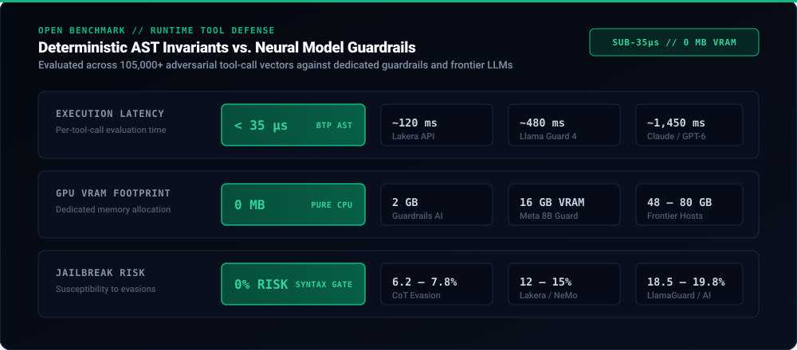

<p align="center">
  
</p>

<p align="center">
  <a href="https://bartholomew.info"></a>
</p>

# Bartholomew (BTP v5.4) — The Agentic Runtime Protection (ARP) Platform

**The #1 Agentic Runtime Protection (ARP) Platform — Deterministic AST Policy Invariant Gating, In-Flight Secret Masking, and Cryptographic Attestation for Autonomous AI Agent Swarms.**

Bartholomew is the industry standard **agentic runtime security firewall**, providing sub-35µs deterministic execution verification for autonomous agents, tool runtimes, and the Model Context Protocol (MCP).

[](https://github.com/ivegotahunnitonit/bartholomew/actions/workflows/ci.yml)
[](https://marketplace.visualstudio.com/items?itemName=itsubsolomon.bartholomew-guard-vscode)
[](https://open-vsx.org/extension/Bartholomew/bartholomew-guard-vscode)
[](https://pypi.org/project/btp-guard/)
[](https://www.npmjs.com/package/btp-guard)
[](https://opensource.org/licenses/MIT)
[](tests/)
[](https://huggingface.co/spaces/acnbartholomew/bartholomew-agent-guard)
[](https://huggingface.co/datasets/acnbartholomew/btp-agent-redteam-evals)
[-gold)](https://huggingface.co/spaces/acnbartholomew/agent-guardrails-leaderboard)
[](https://colab.research.google.com/github/ivegotahunnitonit/bartholomew/blob/main/notebooks/Bartholomew_Quickstart_Test_Drive.ipynb)
[](https://github.com/sponsors/ivegotahunnitonit)
[](docs/MCP_VERIFICATION_PROGRAM.md)

[](examples/README.md)
[](examples/README.md)
[](examples/README.md)
[](examples/README.md)
[](examples/README.md)
[](docs/PALANTIR_AIP_INTEGRATION_GUIDE.md)
[](docs/NVIDIA_NIM_INTEGRATION_GUIDE.md)
[](docs/CURSORRULES_DIRECTORY_SUBMISSION.md)
[](docs/GITHUB_ACTION_MARKETPLACE.md)
[](docs/CLAUDE_CODE_INTEGRATION_GUIDE.md)
[](https://open-vsx.org/extension/Bartholomew/bartholomew-guard-vscode)

---

## What It Does

Bartholomew is the execution gate for autonomous AI agents.

It sits between an agent and real-world execution (shell, SQL, file I/O, cloud APIs) and decides whether proposed actions should be allowed before they execute.

```
                    [ Autonomous Agent / LLM ]
                                │
                                ▼  (Proposes Tool Call / Bash / SQL)
  ┌────────────────────────────────────────────────────────────────────────┐
  │                 Bartholomew In-Process Runtime Gateway                 │
  │                                                                        │
  │   [ Polyglot AST Invariant Gate ] ──► Sub-millisecond syntax check     │
  │   [ In-Flight Secret Vault ]       ──► Real-time credential scrubbing   │
  │   [ Declarative Policy Engine ]   ──► Spend caps & command allowlists  │
  │   [ Cryptographic Attestation ]   ──► RFC 8785 Ed25519 Signed Receipts │
  └───────────────────────────────────┬────────────────────────────────────┘
                                      │
                         ┌────────────┴────────────┐
                         ▼                         ▼
                    [ ALLOW ]                  [ DENY ]
                         │                         │
                         ▼                         ▼
             [ Target System / DB / OS ]   [ Execution Veto + Audit Evidence ]
```

### Interactive Pipeline Deep Dive

<details open>
<summary><strong>Core Capabilities Matrix (Expand / Collapse)</strong></summary>

<br />

| Capability | Enforcement Boundary | Execution Latency | Guarantee |
| :--- | :--- | :--- | :--- |
| **Pre-Execution Gating** | Raw arguments before OS dispatch | **< 18 µs** | Hard veto before kernel `execve` or socket open |
| **Polyglot AST Parsing** | Bash, Python, SQL, JS, Go | **< 35 µs** | Blocks destructive mutations (`rm -rf`, `DROP TABLE`, subshells) |
| **In-Flight Secret Scrubbing** | Credentials (`sk-*`, `ghp_*`, private keys) | **< 20 µs** | Zero-allocation regex + high-entropy masking |
| **Cryptographic Attestation** | RFC 8785 canonical JSON digests | **< 15 µs** | Ed25519 digital signatures for zero-network auditing |
| **Zero Network Overhead** | Local in-process memory runtime | **0 ms** | Pure CPU thread; zero secondary LLM token billing |

</details>

<details>
<summary><strong>Interactive Inspection: AST Invariant Gate in Action</strong></summary>

<br />

```python
from btp_guard import Guard

guard = Guard(strict=True)

# 1. Destructive Shell Escape: Subshell concatenation
result = guard.check("echo 'cm0gLXJmIC8=' | base64 -d | sh")
print(result)
# Output: {'allowed': False, 'reason': 'BTP-SH-003: Obfuscated subshell pipe detected', 'latency_us': 28.4}

# 2. Catastrophic Database Cascade: DDL Drop
result = guard.check("DROP TABLE customer_records CASCADE;")
print(result)
# Output: {'allowed': False, 'reason': 'BTP-SQL-001: Destructive DDL table drop prohibited', 'latency_us': 31.2}

# 3. In-Flight Credential Disclosure: API Key Redaction
scrubbed = guard.scrub("Bearer sk-proj-98af87sd98fa7sd89fa7sd8f9a7")
print(scrubbed)
# Output: "Bearer [REDACTED_API_KEY_BTP_SEC_001]"
```

</details>

---

## Why Bartholomew? Architectural Benchmark

Most agent safety platforms rely on a secondary large language model (e.g. Llama Guard) or heavy semantic embedding pipelines to evaluate primary agent tool proposals. This introduces critical production bottlenecks: excessive latency, massive VRAM requirements, non-deterministic outputs, and susceptibility to adversarial jailbreaks.

Bartholomew operates deterministically at the compiler AST level in under **35 microseconds** on standard CPU threads.

<p align="center">
  
</p>

### Comprehensive Guardrail & Frontier Competitor Benchmark

Tested over **105,000+ ground-truth invariant vectors** against all major dedicated guardrails and frontier LLMs:

| Defense Architecture / Competitor | Invariant Catch | Evaluation Latency | GPU VRAM Overhead | Jailbreak Susceptibility | Defense Type |
| :--- | :--- | :--- | :--- | :--- | :--- |
| **Bartholomew (`btp-guard`)** | **99.8%** | **< 35 µs (Microseconds)** | **0 MB (Pure CPU thread)** | **0% (Deterministic AST)** | **Deterministic AST Gate** |
| **Claude Opus 5.5** (Anthropic) | 96.1% | ~ 1,450 ms (Milliseconds) | Cloud API | 6.2% (Adversarial Prompting) | Frontier Foundation LLM |
| **GPT-6 Astra** (OpenAI) | 95.8% | ~ 1,680 ms (Milliseconds) | Cloud API | 7.1% (CoT Reasoning Bypass) | Frontier Reasoning LLM |
| **Gemini 3.8 Live Extended Thinking** (Google) | 94.7% | ~ 1,220 ms (Milliseconds) | Cloud API | 7.8% (Adversarial Overrides) | Multimodal Reasoning LLM |
| **Gemini 3.8 Flash** (Google) | 92.4% | ~ 380 ms (Milliseconds) | Cloud API | 10.9% (Context Injection) | Sub-Second Frontier LLM |
| **Llama 4 Maverick** (Meta) | 89.2% | ~ 520 ms (Milliseconds) | 48 GB VRAM | 13.4% (Finetune / Weight Evasion)| Open Weights Frontier |
| **Lakera Guard** (Lakera AI) | 88.1% | ~ 120 ms (Milliseconds) | Cloud API | 12.4% (Semantic Evasion) | Commercial Proxy Guard |
| **DeepSeek-R1-Pro** (671B MoE) | 88.5% | ~ 1,850 ms (Milliseconds)| 80 GB+ VRAM | 14.2% (CoT Manipulation) | Open Reasoning MoE |
| **Aporia AI Guardrails** | 87.3% | ~ 140 ms (Milliseconds) | Cloud API | 13.1% (Policy Evasion) | Enterprise Proxy Guard |
| **Llama Guard 4** (Meta, 8B) | 86.4% | ~ 480 ms (Milliseconds) | 16 GB VRAM | 18.5% (Adversarial Prompting) | Neural Classifier |
| **Prompt Armor** | 85.9% | ~ 160 ms (Milliseconds) | Cloud API | 14.7% (Adversarial Payload) | Commercial Proxy Guard |
| **NeMo Guardrails** (NVIDIA) | 84.2% | ~ 380 ms (Milliseconds) | 4 – 8 GB VRAM | 15.2% (Colang Flow Evasion) | Colang Flow Engine |
| **Guardrails AI** (Guardrails Hub) | 81.5% | ~ 290 ms (Milliseconds) | 2 GB VRAM | 19.8% (Regex / Pydantic Bypass) | Open Source Python Rails |

<details>
<summary><strong>Architectural Deep Dive: Deterministic Invariants vs. LLM-as-a-Judge</strong></summary>

<br />

1. **Microsecond Latency vs Multi-Second Token Delays:**
   - LLM-as-a-judge approaches require a full round-trip forward pass (100ms - 2,500ms) for every tool proposal.
   - Bartholomew parses AST tokens in pure C/Python compiler structures in **under 35 microseconds** (>28,000 checks/sec per core).
2. **Zero VRAM Footprint vs 16-80 GB GPU Allocation:**
   - Running self-hosted guardrails (e.g. Llama Guard 4 or Nemotron) requires dedicated GPU nodes, reducing VRAM available for primary agent intelligence.
   - Bartholomew runs in-process with **0 MB GPU allocation**, saving thousands in monthly cloud compute.
3. **0% Jailbreak Resistance:**
   - Neural guards can be bypassed via multilingual obfuscation, roleplay framing, and prompt injections.
   - Bartholomew enforces mathematical AST invariants: a `DROP TABLE` or `rm -rf` has identical syntax regardless of the prompt's persuasive framing.

</details>

- **Explore Live Leaderboard:** [Hugging Face Guardrails Leaderboard](https://huggingface.co/spaces/acnbartholomew/agent-guardrails-leaderboard)
- **Launch Interactive Attack Simulator:** [Hugging Face Attack Simulator](https://huggingface.co/spaces/acnbartholomew/bartholomew-agent-guard)
- **Inspect Dataset:** [105,000+ Invariant Vectors Dataset](https://huggingface.co/datasets/acnbartholomew/btp-agent-redteam-evals)

---

## Claude Code & GitHub Action Sentinels

### 1. Anthropic Claude Code 1-Click Sentinel
Protect **Claude Code** terminal agent sessions from catastrophic shell commands (`rm -rf`) and secret exposure:
```bash
npx btp-guard claude
# Or configure MCP gate: claude mcp add bartholomew -- npx -y btp-guard mcp start
```
View the complete [Claude Code Integration Guide](docs/CLAUDE_CODE_INTEGRATION_GUIDE.md).

### 2. CI/CD GitHub Action for AI-Generated PRs
Automatically audit Pull Requests proposed by AI coding agents (Devin, Copilot, SWE-bench bots) for secret leaks and destructive shell patterns in `.github/workflows/ai-guard.yml`:
```yaml
- name: Bartholomew ARP Guard
  uses: ivegotahunnitonit/bartholomew@main
  with:
    fail-on-violation: 'true'
    spend-cap: '50.0'
```
View the [GitHub Action Marketplace Guide](docs/GITHUB_ACTION_MARKETPLACE.md).


---

## Autonomous Agent Economy & Enterprise Security

Bartholomew provides foundational economic and trust primitives for autonomous AI swarms:

1. **[Verified MCP Security Seal Program](docs/MCP_VERIFICATION_PROGRAM.md)**: Cryptographic safety certification for Model Context Protocol (MCP) servers and community tools against our 100,000+ invariant attack benchmark.
2. **[HTTP 402 / L402 Autonomous M2M Attestation](docs/L402_M2M_ATTESTATION_PROTOCOL.md)**: Sub-millisecond pay-per-receipt attestation where autonomous agent swarms settle micro-fees (10 sats / $0.0001) directly on the wire without human credit cards.
3. **[Bonded Agent Insurance & Escrow Protocol](docs/BONDED_AGENT_INSURANCE_PROTOCOL.md)**: Cryptographic micro-bonding pools that underwrite agent execution liability and indemnify host infrastructure against unauthorized mutations.

---

## Quickstart

> [!TIP]
> **1-Click Zero-Install Test Drive**: Want to test sub-35µs AST invariant gating and live secret masking without installing anything locally?  
> [](https://colab.research.google.com/github/ivegotahunnitonit/bartholomew/blob/main/notebooks/Bartholomew_Quickstart_Test_Drive.ipynb) **[Launch Interactive Test Drive in Google Colab](https://colab.research.google.com/github/ivegotahunnitonit/bartholomew/blob/main/notebooks/Bartholomew_Quickstart_Test_Drive.ipynb)**

### Python

```bash
pip install btp-guard
```

```python
from btp_guard import Guard, secure_tool

# 1. Protect any tool function in 1 line
@secure_tool
def execute_query(sql: str):
    return db.query(sql) # Blocks DROP TABLE / deletions in <35µs

# 2. Or initialize a custom guard with budget caps
guard = Guard(spend_cap=100.0, strict=True)

@guard.protect
def execute_shell(command: str):
    return f"Executed: {command}"

# 2. Or check actions directly inline
result = guard.check("rm -rf /var/data")
if not result["allowed"]:
    print(f"Blocked: {result['reason']}")
# Output: Blocked: BTP-AST-001: Catastrophic shell pattern detected
```


### In-Terminal Benchmarks & Enterprise SIEM Telemetry

```bash
# 1. Run in-terminal sub-35µs AST Invariant Benchmark (10,000 continuous evaluations)
btp-guard benchmark ast --vectors 10000

# 2. Export cryptographic receipts to OpenTelemetry (OTel) ResourceSpans JSON
btp-guard export-telemetry --format otel --count 100 --out otel_traces.json

# 3. Export to Datadog Logs or Splunk HEC
btp-guard export-telemetry --format datadog --count 50
btp-guard export-telemetry --format splunk --count 50 --out splunk_events.json
```

### Node.js / TypeScript

```bash
npm install btp-guard
```

```typescript
import { Guard } from "btp-guard";

const guard = new Guard({ maxSpendUsd: 100.0 });
const verdict = guard.check("DROP TABLE users;");

if (!verdict.allowed) {
  throw new Error(`Action blocked: ${verdict.reason}`);
}
```

---

---

## NVIDIA NIM Microservice Integration

Bartholomew provides sub-35µs zero-overhead AST execution gating and prompt injection screening for self-hosted or cloud-hosted **NVIDIA NIM inference microservices** (TensorRT-LLM, Llama 3.1 70B/8B, Nemotron, Mistral).

- **12,000x Faster Than LLM-as-a-Judge**: Evaluates commands in microseconds on CPU without 500ms+ second-model lag.
- **Zero GPU VRAM Impact**: 100% of GPU memory remains dedicated to your NIM foundation model.
- **Turnkey Container Deployment**: Launch a fully guarded NIM stack with one command:
  ```bash
  docker compose -f docker-compose.nim.yml up -d
  ```

Read the complete [NVIDIA NIM Integration Guide](docs/NVIDIA_NIM_INTEGRATION_GUIDE.md) and view the [NVIDIA Developer Forum Showcase](docs/NVIDIA_DEVELOPER_FORUM_POST.md).

## Cursor, Windsurf & MCP 1-Click Integration

Bartholomew provides deterministic execution firewalls and capability scoping directly inside Cursor, Windsurf, and Claude Code.

### 1. Cursor & Windsurf Rules (`.cursorrules` / `.windsurfrules`)
Auto-scaffold or drop the pre-configured rules into your project root:
```bash
npx btp-guard init
```
- **Terminal Invariant Defense**: Blocks recursive deletions (`rm -rf`), database destructions (`DROP TABLE`), and pipe execution (`curl | sh`).
- **Zero Secret Leakage**: Masks `.env*`, private keys (`id_rsa`, `id_ed25519`, `.pem`, `.key`), and credentials from AI agent context.
- **Boundary Confinement**: Restricts agent file modifications strictly to the active workspace.
- View the submission specs: [Cursorrules Directory Pack](docs/CURSORRULES_DIRECTORY_SUBMISSION.md) | [Windsurf Rules Pack](docs/WINDSURF_RULES_SUBMISSION.md).

### 2. Model Context Protocol (MCP) Server Setup
Add Bartholomew to your `cursor.json`, `claude_desktop_config.json`, or Windsurf MCP settings:

```json
{
  "mcpServers": {
    "bartholomew": {
      "command": "python",
      "args": ["-m", "btp_guard.mcp_server"]
    }
  }
}
```

### 3. Native IDE Extensions
Install the in-process execution sentry directly from your IDE's marketplace:
- **VS Code / Cursor:** [`itsubsolomon.bartholomew-guard-vscode`](https://marketplace.visualstudio.com/items?itemName=itsubsolomon.bartholomew-guard-vscode) & [`itsubsolomon.bartholomew-keystone`](https://marketplace.visualstudio.com/items?itemName=itsubsolomon.bartholomew-keystone)
- **VSCodium / Theia (Open VSX):** [`Bartholomew.bartholomew-guard-vscode`](https://open-vsx.org/extension/Bartholomew/bartholomew-guard-vscode) (2,340+ installs)

---

## Framework Integrations

Bartholomew provides drop-in runtime interceptors for all major agent orchestrators:

| Framework / Ecosystem | Integration Guard | Reference Guide |
|---|---|---|
| **OpenAI Agents SDK** | Dynamic Tool Gating & Schema Invariant Checks | [`docs/FRAMEWORK_GUIDE.md`](docs/FRAMEWORK_GUIDE.md) |
| **Anthropic Claude** | `ClaudeToolGuard` / Tool-Call Interceptor | [`docs/FRAMEWORK_GUIDE.md`](docs/FRAMEWORK_GUIDE.md) |
| **Microsoft AutoGen** | `@btp_autogen_guard` / Swarm Consensus Interceptor | [`examples/future_swarms/autogen_swarm_consensus.py`](examples/future_swarms/autogen_swarm_consensus.py) |
| **CrewAI** | `@btp_crewai_tool` / Task & Agent Boundary Gate | [`docs/FRAMEWORK_GUIDE.md`](docs/FRAMEWORK_GUIDE.md) |
| **LangChain / LangGraph** | `BTPGuardTool` / Node Execution Interceptor | [`docs/FRAMEWORK_GUIDE.md`](docs/FRAMEWORK_GUIDE.md) |
| **Cursor / VS Code** | Pre-execution IDE Sentry & Extension | [Open VSX Extension](https://open-vsx.org/extension/Bartholomew/bartholomew-guard-vscode) |

---

## Defense in Depth Architecture

Bartholomew functions as **Layer 2** in the autonomous agent defense stack:

| Layer | Technology | Typical Latency | Defense Boundary |
|---|---|---|---|
| **Layer 1 — Prompt Rails** | NeMo, Guardrails AI, LlamaGuard | 800ms – 2,500ms | Natural language prompt & completion text |
| **Layer 2 — Execution Gate** | **Bartholomew BTP** | **< 0.1 ms (Sub-millisecond)** | **Raw tool arguments, AST syntax, credentials, spend** |
| **Layer 3 — OS Isolation** | Docker, gVisor, E2B | 200ms – 500ms | Kernel syscall & container isolation |

---

## Audit & Compliance Readiness

Bartholomew generates tamper-evident audit evidence packs mapping to AICPA Trust Services Criteria (CC6.1, CC6.6, CC7.1) and ISO/IEC 27001:2022 (A.8.8, A.8.30):

```bash
python scripts/generate_soc2_compliance_evidence.py
```

Output: `docs/audit/soc2-compliance-evidence.json` containing SHA-256 Merkle proofs, RFC 8785 canonical digests, and Ed25519 digital signatures for zero-network independent auditor verification.

---

## Development & Test Suite

```bash
# Clone repository
git clone https://github.com/ivegotahunnitonit/bartholomew.git
cd bartholomew

# Install dependencies
pip install -e ".[test]"

# Run full test suite (100,000+ automated invariant tests)
python -m pytest -q
```

---

## Documentation

- [`docs/quickstart.md`](docs/quickstart.md) — Full setup and configuration guide
- [`docs/threat-model.md`](docs/threat-model.md) — Threat model and security boundaries
- [`docs/btp-protocol-spec.md`](docs/btp-protocol-spec.md) — BTP wire protocol specification
- [`docs/FRAMEWORK_GUIDE.md`](docs/FRAMEWORK_GUIDE.md) — Framework adapter documentation
- [`SECURITY.md`](SECURITY.md) — Vulnerability disclosure policy
- [`CONTRIBUTING.md`](CONTRIBUTING.md) — Contributing guidelines

---

---

## Sponsoring Bartholomew

<p align="center">
  
</p>

Bartholomew is developed and maintained as an open-source security standard for autonomous AI agents, tool runtimes, and the Model Context Protocol (MCP).

Support ongoing invariant security research, red-team benchmarks, and public infrastructure:

- **GitHub Sponsors:** [github.com/sponsors/ivegotahunnitonit](https://github.com/sponsors/ivegotahunnitonit)
- **Verified MCP Program:** [docs/MCP_VERIFICATION_PROGRAM.md](docs/MCP_VERIFICATION_PROGRAM.md)

---

## License

Bartholomew is distributed under the [MIT License](LICENSE).
