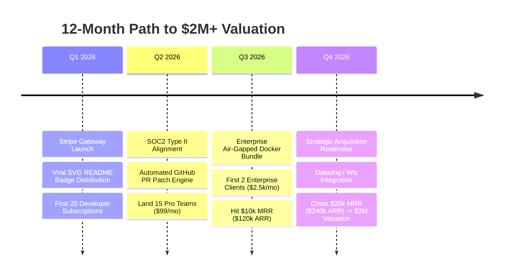

# 🚀 Agentic-Eval: $2,000,000+ Enterprise Valuation Scaling Playbook

This document outlines the strategic growth roadmap, financial modeling, enterprise compliance metrics, and GTM milestones required to scale **Agentic-Eval / ACN** to a **$2,000,000 – $5,000,000 Valuation**.

---

## 📊 1. Financial & ARR Valuation Target

To command a **$2,000,000 Valuation** at standard AI SaaS multiples (8x – 10x ARR):
- **ARR Target**: **$200,000 – $250,000 ARR** ($16,600 – $20,800 Monthly Recurring Revenue).
- **Customer Acquisition Mix**:
  - **100 Developer API Subscriptions** @ $19/mo = **$1,900 / mo** ($22.8k ARR)
  - **50 Pro Team Subscriptions** @ $99/mo = **$4,950 / mo** ($59.4k ARR)
  - **4 Enterprise Retainers** @ $2,500/mo = **$10,000 / mo** ($120.0k ARR)
  - **10 One-time B2B Security Audits** @ $250/report = **$2,500 / mo** ($30.0k ARR)
- **Total Portfolio MRR**: **$19,350 / mo** (**$232,200 ARR**).
- **Valuation @ 9x Multiple**: **$2,089,800 USD**.

---

## 💳 2. Exclusive Stripe Transaction Standard

All platform transactions are routed exclusively through Stripe for automated provisioning:

1. **Stripe Checkout Sessions**: Direct checkout endpoints (`POST /api/v1/stripe/create-checkout-session`) handle one-time audit reports and monthly recurring plans.
2. **Stripe Webhook Listener**: Endpoint (`POST /api/v1/stripe/webhook`) automatically catches `checkout.session.completed` events to:
   - Issue cryptographically signed enterprise API keys (`age_live_...`).
   - Trigger automated SOC2 & OWASP LLM Top 10 attestation certificate generation.
3. **Stripe Customer Portal**: Self-serve portal (`POST /api/v1/stripe/customer-portal`) allowing clients to upgrade, downgrade, or update payment methods seamlessly.

---

## 🏗️ 3. Core Technical Value Drivers ($2M IP Stack)

1. **Sub-Millisecond Execution Daemon (Golang Native)**:
   - **Performance**: 1.44 μs latency / 775,935 ops/sec line scanner.
   - Eliminates TCP socket setup latency with connection-pooled sessions.
2. **OWASP LLM Top 10 (2026 Edition) Security Suite**:
   - Automated detection across LLM01 to LLM10: prompt injections, secret leaks (OpenAI, AWS, Stripe, GitHub, Google, JWT), silent try/except traps, infinite tool loops, and XSS responses.
3. **Viral SVG Security Badge Ecosystem**:
   - Embeddable glowing SVG badge (`Secured by Agentic-Eval`) for AI startup READMEs, driving organic referral traffic back to public verification certificates (`/verify/{cert_id}`).

---

## 🗓️ 4. 12-Month Execution Milestones to $2M

---

## 🎯 5. Potential Enterprise Acquirers

Once ARR crosses $200k+, prime strategic acquirers include:
1. **Datadog / Sentry / New Relic** (Expanding into LLM Observability & Trajectory Monitoring).
2. **Wiz / Palo Alto Networks** (Adding AI Agent Secret Scrubbing & Guardrails to Cloud Security Suites).
3. **LaunchDarkly / PostHog** (Feature flagging & experiment evaluation for LLM workflows).

---
*Generated by ACN Enterprise Valuation Engine v2.0*
